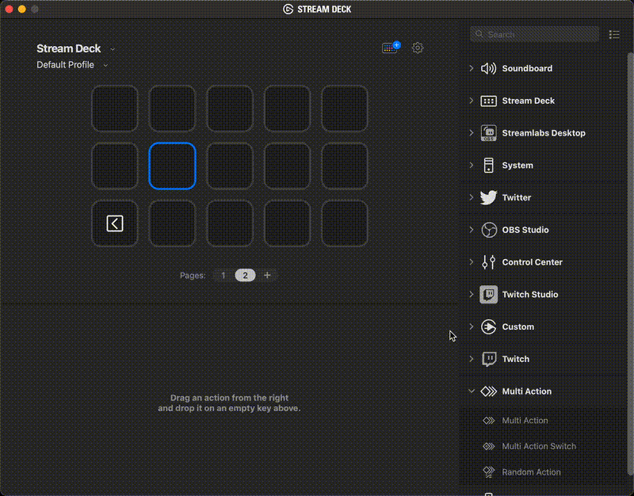
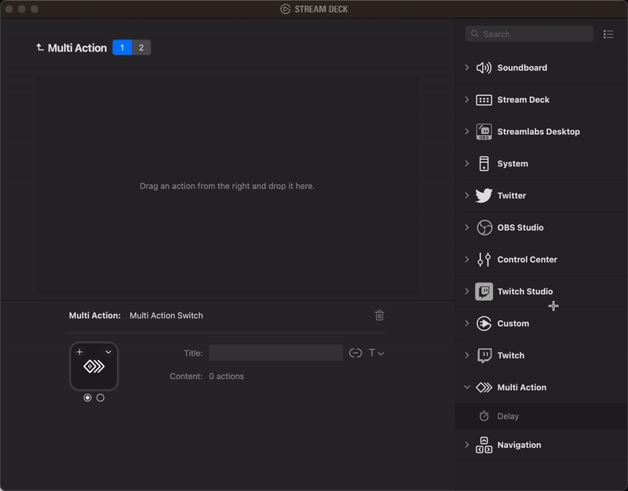
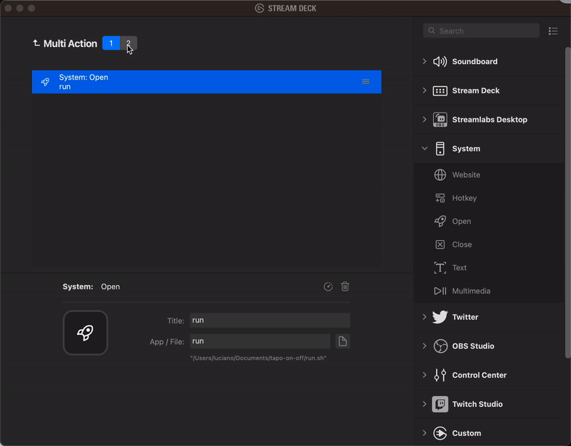

# TP-Link L920 on/off script

This is a (very) simple Rust binary that can turn on/off a [TP-Link L920](https://www.tp-link.com/uk/home-networking/smart-bulb/tapo-l920-5/) led light strip in your local network.


## Installation

Requires you to have a modern version of Rust.

Clone this repo and run:

```bash
cargo build --release
```

Then the binary will be available in `<your-local-repo>/target/release/tapo-l920-on-off`

Alternatively, if you want to let cargo clone the git repo, compile the binary and make it available in your system PATH, you can run the following command:

```bash
cargo install --git git@github.com:lmammino/tapo-l920-on-off.git
```


## Usage

Note: you must have a Tapo account and your led strip must have been registered there.

The binary requires 3 environment variables to be set:

- `TAPO_USERNAME`: your TAPO email
- `TAPO_PASSWORD`: your TAPO password
- `TAPO_DEVICE_IP`: your L920 device local IP Address

You can use the [`.env~sample`](/.env~sample) example in this repo as a reference.

Once, these variables are set, just execute the binary and if the led strip is on, it will be turned off and vice versa!

If you create a `.env` file with the necessary environment variables, you can simply run the [`run.sh`](/run.sh) script in this repository.


## Troubleshooting

If you are experiencing unexpected issues or errors, you can get more insights into what's going on by enabling `DEBUG` logs.

You can do that by setting the following environment variable:

```bash
export RUST_LOG=debug
```

For even more verbose logs you can set the `RUST_LOG` variable to `trace`.


## Use with an Elgato Stream deck

I created this script so I can have a shortcut to turn my led strip on and off from my Elgato Stream Deck.

Below there's a description of my setup, in case you want to do something similar.

> **Note**
> These instructions have only been tested on a Mac. If you use Windows or Linux, this setup might vary slightly. PRs are welcome to fix any gap that might exist for other OSs.

### 1. Install & configure

- Install the binary by cloning the repo and compiling the binary yourself.
- Copy the `.env~sample` to `.env` and fill out the details.
- Execute the `run.sh` script and make sure it works.

### 2. Configure your Stream Deck

#### 2.1 Open your Stream Deck application.

Do it! 😊

#### 2.2 Pick an empty button as your destination and drag a "Multi Action Switch" action onto it



#### 2.3 Select the "Open" action and drop it into the "Multi Action" area (Panel 1). Configure it to run the shell script.



#### 2.4 Switch to Panel 2 and repeat the same process




#### 2.5 Customise your icons to represent on/off states (optional)

Pick a lightbulb or something like that from the Elgato icon library. Or if you feel brave enough, you can even create your custom icon! 👩‍🎨


> **Warning**
> With this approach, I couldn't find any way to update the Stream Deck button in case the state of the led strip changes due to external factors (scheduled activation, activation through app or physical button, etc.), therefore your button status (on/off), might go off sync and show inverted indicators (on when it is actually off and viceversa). In this case, make sure to use the TP-link app or the physical button to bring the led strip to the same state displayed in yours Stream Deck button.


## Acknowledgements

Huge thanks to [Mihai Dinculescu](https://crates.io/users/mihai-dinculescu) for their awesome work on the [`tapo` crate](https://crates.io/crates/tapo) which made this project quite trivial to implement.


## Contributing

Everyone is very welcome to contribute to this project.
You can contribute just by submitting bugs or suggesting improvements by
[opening an issue on GitHub](https://github.com/lmammino/tapo-l920-on-off/issues).


## License

Licensed under [MIT License](LICENSE). © Luciano Mammino